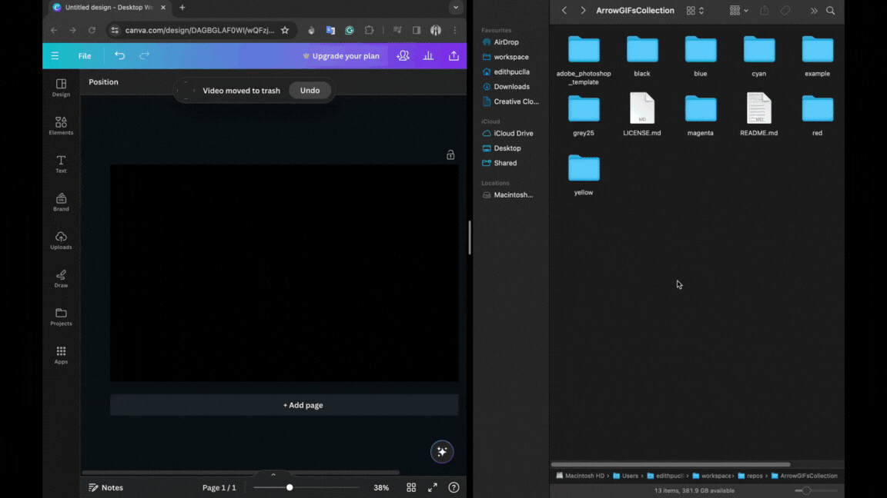

# Arrow GIFs Collection

This is a basic collection of animated arrow GIFs, perfect for web pages, presentations, and digital content. Currently offering only a variety of colors and speeds, these arrows are designed to guide, direct, and add motion to your projects. You can do thing like this:

 <p align="center">
    
  </p>
  
I've been frequently asked "How do you make those animated GIFs, and what tools do you use? 🤔 "

I had myself the same question in the pass, but I didn't find any solution for me, so I decided to do it on my own.

**Note**: There are indeed better options available, including paid and easier ones. However, this repository is designed with those in mind who can only use free tools.

Here's what I used for the above GIF example:

- [Canva](https://www.canva.com/) (Free Version) for basic designs and free GIFs, like spinning arrows.
- Adobe Photoshop for generating animated arrows, which are not available in Canva's free version, maybe but not any that I liked it 🙃.

🌼🌸 _It's come to my attention that not everyone has access to the tools necessary for creating animated arrows that bring technical GIFs to life and help explain concepts._

To meet this need, I've created a simple set of colorful arrows. Now, you can quickly turn ideas into GIFs without getting stuck due to a lack of an arrow.

You'll see that arrows are categorized by colors (red, green, cyan, blue, magenta, white, black, grey 25%) and speed (0s, 0.1s, 0.2s, 0.5s), with 0s being faster than the others and 0.5 the slowest.

## Red

0s - 0.1s - 0.2s - 0.5s


## Yellow

0s - 0.1s - 0.2s - 0.5s


## Green

0s - 0.1s - 0.2s - 0.5s


## Cyan

0s - 0.1s - 0.2s - 0.5s


## Blue

0s - 0.1s - 0.2s - 0.5s


## Magenta

0s - 0.1s - 0.2s - 0.5s


## White

0s - 0.1s - 0.2s - 0.5s


## Black

0s - 0.1s - 0.2s - 0.5s


## Grey

0s - 0.1s - 0.2s - 0.5s


## How to use it?

1. Clone the repository:

```bash
git clone https://github.com/edithturn/ArrowGIFsCollection.git
cd ArrowGIFsCollection
```

2.  Drag and Drop in Canva

Explore the directories, choose the arrow you want, and drag and drop it into Canva! Enjoy and bring your creativity to life now!

  <p align="center">
    
  </p>

I also added the file in Photoshop; if you have Photoshop, you can find the [template](adobe_photoshop_template/arrow_template.psd)

## License

This work is licensed under a [Creative Commons Attribution 4.0 International License](https://creativecommons.org/licenses/by/4.0/).

[def]: agenta/arrow_down_magenta_0.5s.gi
